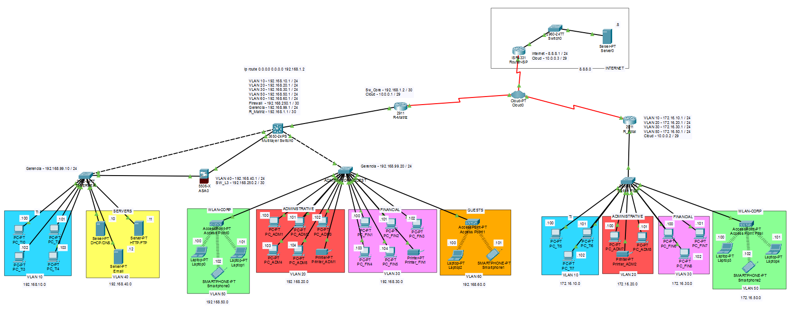
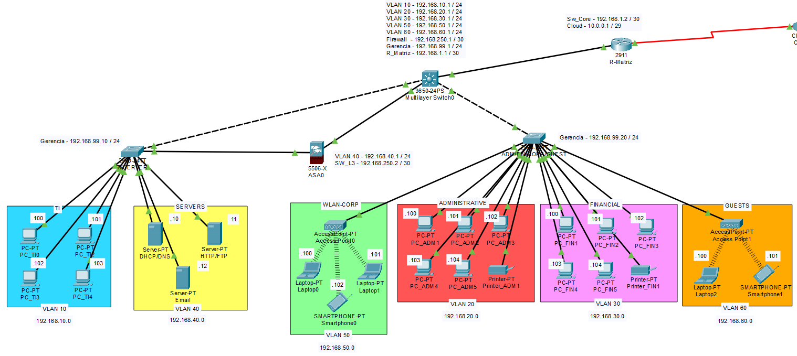
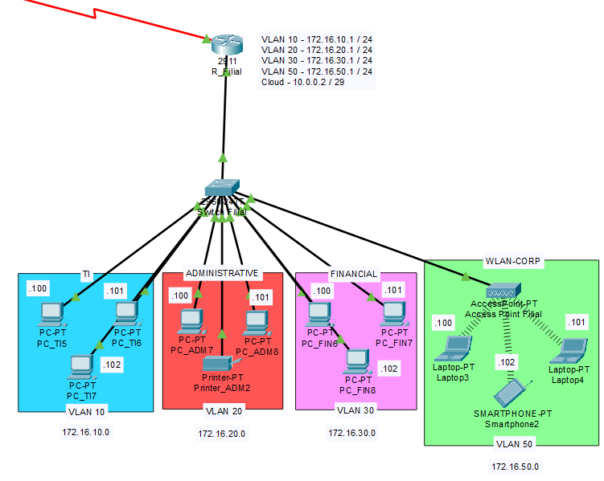
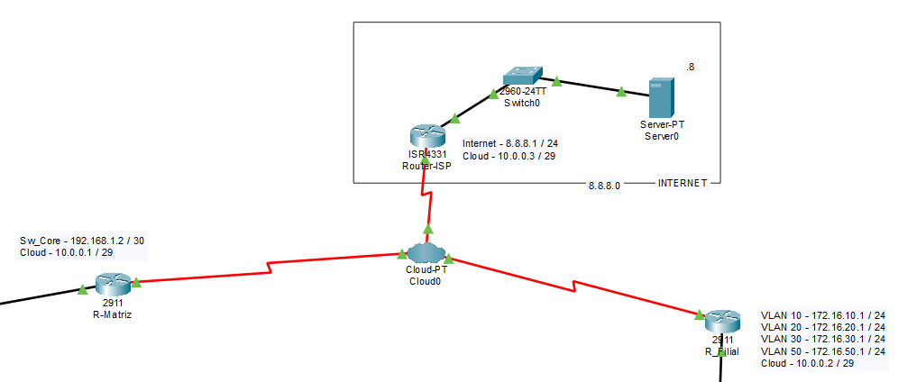
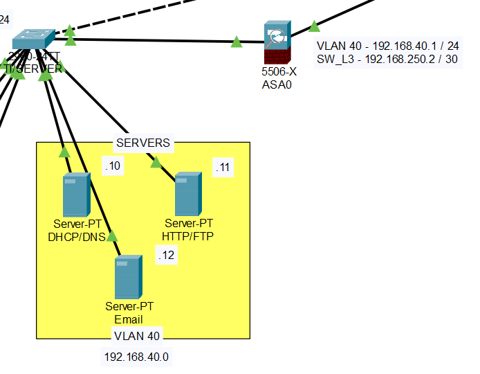

# Infraestrutura de Rede Corporativa — TechSolutions
Projeto de infraestrutura de rede corporativa desenvolvido no **Cisco Packet Tracer**, simulando o ambiente de uma empresa de tecnologia com Matriz, Filial, Data Center/Servidores, rede Wireless e acesso à Internet.

A proposta foi desenvolver um ambiente semelhante ao encontrado em uma empresa de pequeno/médio porte, contemplando Matriz, Filial, servidores, rede wireless, segmentação por VLANs, roteamento entre redes, serviços de infraestrutura, acesso remoto, firewall e uma Internet simulada.

O projeto foi desenvolvido com foco em:
- Segmentação e organização da infraestrutura;
- Comunicação entre Matriz e Filial;
- Implementação de serviços de rede;
- Segurança e controle de acesso;
- Administração remota dos dispositivos;
- Comunicação com uma Internet simulada;
- Validação da conectividade através de testes práticos;
- Aplicação dos principais protocolos da arquitetura TCP/IP.

## Cenário e Escopo do Projeto

 A TechSolutions necessitava de uma rede corporativa moderna que garantisse alta disponibilidade, segurança no tráfego de dados e isolamento de setores críticos. O projeto foi estruturado em três pilares principais:

*   **Matriz:** Concentra a maior parte dos setores, rede sem fio corporativa (WLAN) e rede isolada para visitantes.
*   **Filial:** Extensão operacional da empresa, integrada à Matriz, contendo os mesmos setores internos essenciais.
*   **Data Center / Zona de Servidores:** Uma área restrita e altamente protegida por firewall para hospedar os serviços centrais da empresa.
*   **Simulação de Internet (WAN):** Saída para uma rede externa simulada através de uma nuvem (Cloud) conectada a um roteador ISP, com acesso ao servidor DNS público `8.8.8.8`.

## Tecnologia e Protocolos Utilizados
 O projeto foi construído utilizando uma ampla gama de protocolos das camadas da arquitetura TCP/IP:

*   **Camada de Aplicação:** HTTP (Transferência WEB), FTP (Transferência de Arquivos), SSH (Gerência remota segura), SMTP e POP3 (Serviços de E-mail), DHCP (Distribuição dinâmica de IPs) e DNS (Resolução de nomes).
*   **Camada de Transporte:** **TCP** (para HTTP, FTP, SSH, E-mail) e **UDP** (para DHCP, DNS).
*   **Camada de Rede e Roteamento:** **IP** (Endereçamento lógico), **Roteamento Estático** (para interligação de todas as redes e rotas de saída) e **ICMP** (Testes de conectividade/Ping).
*   **Camada de Enlace e Física:** **Ethernet** (Rede cabeada), **ARP** (Resolução de endereços MAC) e **802.11 Wireless** via Access-Point.
*   **Segmentação e Segurança:** **VLANs** (IEEE 802.1Q) e regras de **ACLs (Access Control Lists)** aplicadas em um dispositivo **ASA Firewall** e **Gateways**.

## Topologia Física

## Arquitetura da Rede
 A infraestrutura é composta por uma Matriz, uma Filial e uma rede WAN/Internet simulada.

### **Matriz**
#### A Matriz possui as seis VLANs do projeto:

|  ⠀ ⠀ ⠀ ⠀ ⠀ ⠀ ⠀ ⠀ ⠀ ⠀ ⠀ ⠀ ⠀ VLAN | ⠀ ⠀ ⠀ ⠀ ⠀ ⠀ ⠀ ⠀ ⠀ ⠀ ⠀ ⠀ ⠀ ⠀ ⠀ ⠀  Nome |  ⠀ ⠀ ⠀ ⠀ ⠀ ⠀ ⠀ ⠀ ⠀ ⠀ ⠀ ⠀ ⠀ ⠀ ⠀ ⠀ Rede |
| -------- | -------- | -------- |
| 10   | TI   | `192.168.10.0/24`   |
| 20   | ADMINISTRATIVE   | `192.168.20.0/24`   |
| 30   | FINANCIAL   | `192.168.30.0/24`   |
| 40   | SERVERS   | `192.168.40.0/24`   |
| 50   | WLAN-CORP   | `192.168.50.0/24`   |
| 60   | GUESTS   | `192.168.60.0/24`   |

### **Filial**
#### A Filial utiliza o mesmo conceito de segmentação, porém com endereçamento `172.16.x.0/24`.

|  ⠀ ⠀ ⠀ ⠀ ⠀ ⠀ ⠀ ⠀ ⠀ ⠀ ⠀ ⠀ ⠀ VLAN | ⠀ ⠀ ⠀ ⠀ ⠀ ⠀ ⠀ ⠀ ⠀ ⠀ ⠀ ⠀ ⠀ ⠀ ⠀ ⠀  Nome |  ⠀ ⠀ ⠀ ⠀ ⠀ ⠀ ⠀ ⠀ ⠀ ⠀ ⠀ ⠀ ⠀ ⠀ ⠀ ⠀ Rede |
| -------- | -------- | -------- |
| 10   | TI   | `172.16.10.0/24`   |
| 30   | FINANCIAL   | `172.16.30.0/24`   |
| 40   | SERVERS   | `172.16.40.0/24`   |
| 50   | WLAN-CORP   | `172.16.50.0/24`   |

### **WAN/Internet Simulada**
O projeto também possui uma infraestrutura WAN que representa uma conexão com a Internet. Dessa forma, é possível simular o comportamento de uma rede corporativa conectada a um provedor de Internet.

A comunicação WAN é realizada através de um dispositivo Cloud, utilizando conexões seriais DTE (Data Terminal Equipment) entre o Cloud e os três roteadores:

#### Para a comunicação entre os três roteadores foi utilizada a rede: `10.0.0.0/29`

|  ⠀ ⠀ ⠀ ⠀ ⠀ ⠀ ⠀ ⠀ ⠀ ⠀ ⠀ ⠀ ⠀ Dispositivo | ⠀ ⠀ ⠀ ⠀ ⠀ ⠀ ⠀ ⠀ ⠀ ⠀ ⠀ ⠀ ⠀ ⠀ ⠀ ⠀  Endereço IP |  ⠀ ⠀ ⠀ ⠀ ⠀ ⠀ ⠀ ⠀ ⠀ ⠀ ⠀ ⠀ ⠀ ⠀ ⠀ Máscara |
| -------- | -------- | -------- |
| R_Matriz   | `10.0.0.1`   | `/29`   |
| R_Filial   | `10.0.0.2`   | `/29`   |
| R_ISP   | `10.0.0.3`   | `/29`   |

A Internet simulada representa a comunicação da infraestrutura corporativa com uma rede externa. Essa estrutura permite validar o acesso das redes da Matriz e da Filial a um recurso externo por meio da WAN, simulando o funcionamento básico de uma conexão corporativa com um provedor de Internet.

## Controle de Tráfego
A segurança da infraestrutura foi implementada utilizando **Cisco ASA Firewall** em conjunto com **Access Control Lists (ACLs)**, proporcionando controle sobre o tráfego destinado à **VLAN 40 — SERVERS.** Permitindo assim aplicar o princípio de menor privilégio, no qual os dispositivos devem possuir somente o nível de acesso necessário para executar suas funções.

O Cisco ASA fornece uma **camada de controle** entre a infraestrutura de rede e os servidores, aplicando **políticas de segurança** nas suas interfaces evitando que qualquer dispositivo com conectividade de rede tenha acesso irrestrito aos serviços da VLAN 40. Esta proteção é complementada por ACLs, que definem regras específicas para **endereços IP**, **redes** e **tipos de tráfego**, garantindo que apenas as comunicações autorizadas pela política do projeto sejam permitidas.

 

## ⚙ Pré-requisitos e Como Executar
Para abrir, visualizar e testar este laboratório, você precisará do software oficial da Cisco.

*   **Versão Requisitada:** **Cisco Packet Tracer v9.0.0.0810** (ou superior). *Versões anteriores podem apresentar erros ao carregar os dispositivos ou o arquivo `.pkt`.*

### Passo a Passo:
1. Faça o clone deste repositório ou baixe o arquivo do projeto diretamente.
2. Certifique-se de que o Cisco Packet Tracer está instalado e atualizado na versão 9.0.
3. Abra o Packet Tracer, vá em `File > Open` e selecione o arquivo do projeto (`empresa.pkt`).
4. Aguarde alguns segundos para que a convergência da rede (STP/Roteamento) mude os indicadores dos cabos de laranja para verde.

## 💻 Planos de Testes e Validação
Uma vez aberto o cenário no Cisco Packet Tracer, é possível validar o funcionamento dos principais protocolos, serviços e mecanismos de segurança implementados através dos seguintes testes práticos.

**1. 🌐 Endereçamento e Conectividade — DHCP e ICMP**

O serviço **DHCP** está disponível para todas as VLANs do projeto, enquanto a comunicação **ICMP** entre as redes é controlada pelas políticas de segurança configuradas, com restrições específicas para as **VLANs 20, 30, 50 e 60.**
* Abra o **Command Prompt** de qualquer computador da Matriz ou Filial.
* Execute `ipconfig` para verificar se o dispositivo recebeu corretamente o endereço IP, máscara de sub-rede, gateway e DNS através do DHCP.
* Utilize `ping` para testar a comunicação com o gateway da própria VLAN.
* Realize testes de conectividade entre diferentes VLANs para validar o roteamento entre as redes.

**2. 💻 Serviço Web e Resolução de Nomes — HTTP e DNS**

Os serviços **HTTP** e **DNS** estão disponíveis para as VLANs corporativas, enquanto a **VLAN 60 — GUESTS** não possui permissão para acessá-los.
* Abra o `Web Browser` de uma estação autorizada.
Acesse o endereço configurado para o servidor Web utilizando `HTTP`.
* Também é possível validar o funcionamento do DNS acessando os serviços através de seus nomes de domínio em vez de utilizar diretamente seus endereços IP.

**3. 📁 Transferência de Arquivos — FTP**

O acesso ao serviço **FTP** está disponível para as **VLANs autorizadas** (VLANs 10, 20, 30 e 50), enquanto a **VLAN 60 — GUESTS** não possui permissão para acessar o servidor FTP.
* Abra o **Command Prompt** de uma estação autorizada.
* Inicie uma conexão com o servidor FTP.
* Informe as credenciais de um usuário configurado no serviço.
* Teste a listagem dos arquivos disponíveis e, quando aplicável, o envio e recebimento de arquivos.

**4. 📧 Serviço de E-mail — SMTP e POP3**

Os serviços de e-mail **SMTP** e **POP3** estão disponíveis para as **VLANs autorizadas** (VLANs 10, 20, 30 e 50), enquanto a **VLAN 60 — GUESTS** não possui permissão para acessar o servidor FTP.
* Abra o cliente de e-mail de uma estação configurada.
* Verifique se a conta possui corretamente configurados o servidor de envio (SMTP) e o servidor de recebimento (POP3).
* Envie uma mensagem para outra conta configurada no projeto.
* Acesse a conta destinatária e verifique o recebimento da mensagem.

**5. 🔐 Administração Remota — SSH**

O acesso **SSH** foi configurado exclusivamente para a **VLAN 10 — TI**, como mecanismo de administração remota dos dispositivos de rede.

Na Matriz, o SSH está configurado nos dispositivos **SW-Vlan_10_40**, **SW-Vlan_20_30_50_60** e **SW_Core**, permitindo que usuários autorizados da VLAN de TI realizem o gerenciamento remoto desses equipamentos.

Para validar:

* Utilize um computador pertencente à VLAN 10 — TI.
* Abra o **Command Prompt**.
* Inicie uma conexão SSH com o endereço IP de gerenciamento do dispositivo.
* Informe as credenciais configuradas.
* Verifique se o acesso ao modo de gerenciamento foi estabelecido.

**6. 🛡️ Segurança e Isolamento — ACLs e ASA Firewall**

A validação da segurança deve verificar não apenas os acessos permitidos, mas também se os acessos não autorizados estão sendo corretamente bloqueados.

* A partir de um dispositivo da **VLAN 60 — GUESTS**, tente acessar recursos pertencentes à **VLAN 40 — SERVERS**.
* Tente realizar comunicação com outros segmentos corporativos que estejam protegidos pelas políticas de segurança.
* A partir de redes autorizadas, realize os mesmos testes para confirmar que os acessos necessários continuam funcionando.
* Observe o tráfego através do **ASA Firewall** utilizando o Simulation Mode do Packet Tracer.
* Verifique o comportamento das **ACLs**, identificando os tráfegos permitidos e negados pelas regras configuradas.

**7. 🌎 Comunicação com a Internet Simulada — WAN**

A comunicação com a **Internet simulada** está disponível para todas as VLANs, incluindo a **VLAN 60 — GUESTS**, sendo esta a única comunicação externa permitida para essa VLAN.

A conectividade externa pode ser validada através da infraestrutura WAN que interliga R_Matriz, R_Filial e R_ISP.

* A partir de um dispositivo da Matriz ou Filial, execute um `ping` para o endereço `8.8.8.8`.
* Verifique o caminho percorrido pelo tráfego através do **Simulation Mode**.
* Confirme a comunicação entre os roteadores da WAN e o **R_ISP**.
* Valide o acesso ao servidor externo que representa a Internet simulada.

## 📜 Licença
Este projeto está disponibilizado para fins **educacionais e de portfólio.**

Você pode adaptar, estudar e utilizar a estrutura como referência para projetos acadêmicos e de aprendizado.

Caso este projeto seja utilizado ou modificado, recomenda-se manter a referência ao projeto original.

## 👩‍💻 Sobre o projeto
Este projeto foi desenvolvido no Cisco Packet Tracer com finalidade de estudo, simulação e demonstração de conhecimentos em infraestrutura e segurança de redes.

A topologia, configurações e políticas apresentadas representam um ambiente corporativo simulado e podem ser adaptadas para diferentes cenários de infraestrutura.

#### ⭐ Projeto desenvolvido em Cisco Packet Tracer 9.0.0.0810